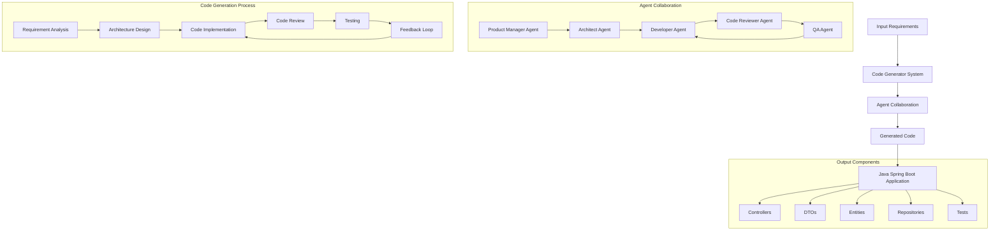

# Autonomous Code Generator - Design Document

## Table of Contents
1. [Introduction](#introduction)
2. [System Architecture](#system-architecture)
3. [Component Design](#component-design)
4. [Data Flow](#data-flow)
5. [Technical Specifications](#technical-specifications)
6. [Security Considerations](#security-considerations)
7. [Extension Points](#extension-points)
8. [Development Guidelines](#development-guidelines)

## 1. Introduction

### 1.1 Purpose
The Autonomous Code Generator is a sophisticated system designed to automatically generate production-ready code from natural language requirements. It leverages the AutoGen framework and Large Language Models (LLMs) to create a multi-agent system that collaborates to produce high-quality code.

### 1.2 Scope
- Generate Spring Boot applications in Java
- Support for REST API development
- Database integration
- Automated test generation
- Code review and quality assurance

### 1.3 System Overview


## 2. System Architecture

### 2.1 Core Components

#### 2.1.1 Input Processing System
- Location: `inputRequirement/` directory
- Supported formats: .txt, .md
- Responsibility: Parse and validate input requirements
- Error handling for malformed inputs

#### 2.1.2 Agent System
1. **Product Manager Agent**
   - Requirement interpretation
   - Feature prioritization
   - User story creation

2. **Architect Agent**
   - System design decisions
   - Component architecture
   - Technology stack validation

3. **Developer Agent**
   - Code generation
   - Implementation of business logic
   - Package structure management

4. **Code Reviewer Agent**
   - Code quality assessment
   - Best practice validation
   - Improvement suggestions

5. **QA Agent**
   - Test case generation
   - Integration testing
   - Performance validation

#### 2.1.3 Code Generation Engine
- File creation and organization
- Smart naming system
- Package structure management
- Code block parsing
- Multi-language support

### 2.2 Output Management
Location: `generated_code/` directory

Structure:
```
generated_code/
├── controllers/
│   └── EmployeeController.java
├── dto/
│   └── EmployeeDto.java
├── entities/
│   └── Employee.java
├── repositories/
│   └── EmployeeRepository.java
└── tests/
    ├── EmployeeControllerTests.java
    └── EmployeeRepositoryTests.java
```

## 3. Component Design

### 3.1 Code Generator
```python
class CodeGenerator:
    - initiate_code_generation(requirements: str)
    - parse_code_blocks()
    - write_to_files()
    - cleanup_generated_code()
```

### 3.2 Agent Configuration
```python
class AgentConfig:
    - temperature: float
    - timeout: int
    - request_timeout: int
    - seed: int
    - model_config: dict
```

### 3.3 File Management
- Automatic cleanup of existing files
- Directory structure creation
- File naming conventions
- Package organization

## 4. Data Flow

### 4.1 Generation Process
1. Read requirements from input file
2. Initialize agent system
3. Process requirements through agent pipeline
4. Generate code files
5. Review and test
6. Apply feedback and iterate

### 4.2 Agent Communication
- Round-robin speaker selection
- Maximum 10 conversation rounds
- Structured message format
- Error handling and recovery

## 5. Technical Specifications

### 5.1 Dependencies
- AutoGen framework
- Mistral AI API
- Python 3.x
- Environment management (dotenv)

### 5.2 Configuration
```python
config_list = [
    {
        "model": "mistral-tiny",
        "api_key": "MISTRAL_API_KEY",
        "base_url": "https://api.mistral.ai/v1",
        "api_type": "mistral"
    }
]
```

### 5.3 Performance Considerations
- Timeout settings: 300 seconds
- Request timeout: 300 seconds
- Maximum context length handling
- File size optimization

## 6. Security Considerations

### 6.1 API Key Management
- Environment variable usage
- Secure key storage
- Key rotation support

### 6.2 File System Security
- Secure file operations
- Directory access control
- Clean-up procedures

## 7. Extension Points

### 7.1 Language Support
- Current: Java (Spring Boot)
- Extensible to other languages
- Framework agnostic design

### 7.2 Custom Agents
- Pluggable agent system
- Customizable behaviors
- Extensible conversation flows

### 7.3 Templates
- Code generation templates
- Custom output formats
- Style customization

## 8. Development Guidelines

### 8.1 Code Organization
- Modular design
- Clear separation of concerns
- Consistent file structure

### 8.2 Best Practices
- Error handling
- Logging
- Testing
- Documentation

### 8.3 Contribution Process
1. Fork repository
2. Create feature branch
3. Implement changes
4. Add tests
5. Submit pull request

## 9. Future Enhancements

### 9.1 Planned Features
- Additional language support
- Enhanced error recovery
- Performance optimization
- UI/UX improvements

### 9.2 Scalability
- Distributed processing
- Parallel code generation
- Resource optimization

---

## Appendix A: Configuration Reference

### A.1 Environment Variables
```
MISTRAL_API_KEY=your_api_key_here
MISTRAL_MODEL=mistral-tiny
```

### A.2 Default Settings
```python
DEFAULT_TIMEOUT = 300
DEFAULT_TEMPERATURE = 0.7
MAX_ROUNDS = 10
```

## Appendix B: Error Codes and Handling

| Error Code | Description | Resolution |
|------------|-------------|------------|
| E001 | Invalid requirements | Check input format |
| E002 | API timeout | Increase timeout or split task |
| E003 | File system error | Check permissions |
| E004 | Context length exceeded | Break down requirements | 